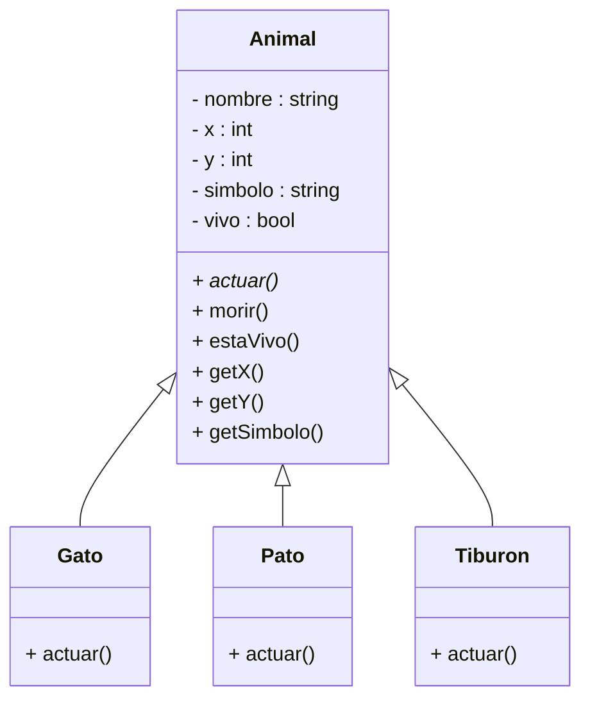

# 🌍 Proyecto: Simulador de Mundos Destructibles

### "Un gato, un pato y un tiburón viven en equilibrio... hasta que tú decides su destino."

---

## 📖 HISTORIA

En un mundo dividido entre tierra (.), agua (~) y vida salvaje, tres especies coexisten:
- **Gato (G)**: el sigiloso cazador de la superficie.
- **Pato (P)**: el explorador anfibio.
- **Tiburón (T)**: el depredador de las profundidades.

Cada mundo es distinto, pero todos comparten algo en común:  
**tu poder para decidir si viven o mueren.**

Tú, el jugador, podrás lanzar una bomba que puede destruir parcial o totalmente su hábitat.  
A veces, uno sobrevive. A veces, ninguno.  
La suerte (y tu conciencia) decidirán su destino.

---

## 🎮 FUNCIONAMIENTO

1. Elige un mundo (1, 2 o 3).
2. Observa el ecosistema inicial.
3. Decide si quieres **destruir el mundo (S/N)**.
4. Si eliges **S**, selecciona el nivel de la bomba:
   - **Nivel 1:** Explosión pequeña.
   - **Nivel 2:** Explosión mediana.
   - **Nivel 3:** Destrucción total (todas las celdas se marcan con "X").
5. Si algún animal queda fuera del área de la explosión, aparecerá un mensaje como:
   > `>>> Pato se ha salvado milagrosamente!`


##  DIAGRAMA UML


## 🎮 CODIGOOOO🤪.... A COMPILAR!!!

```cpp

#include <iostream>
#include <vector>
#include <string>
#include <cstdlib>
#include <ctime>

// ===============================
// 🧩 Clase base Animal
// ===============================
class Animal {
protected:
    std::string nombre;
    int x, y;
    std::string simbolo;
    bool vivo;

public:
    Animal(std::string n, int xPos, int yPos, std::string s)
        : nombre(n), x(xPos), y(yPos), simbolo(s), vivo(true) {}

    virtual void actuar() = 0; // Método virtual puro

    int getX() { return x; }
    int getY() { return y; }
    std::string getSimbolo() { return simbolo; }
    std::string getNombre() { return nombre; }
    bool estaVivo() { return vivo; }
    void morir() { vivo = false; simbolo = "X"; }

    void setPos(int newX, int newY) { x = newX; y = newY; }

    void info() {
        std::cout << nombre << " está en (" << x << "," << y << ") símbolo: " << simbolo << "\n";
    }
};

// ===============================
// 🐱 Clase Gato
// ===============================
class Gato : public Animal {
public:
    Gato(int xPos, int yPos) : Animal("Gato", xPos, yPos, "G") {}
    void actuar() override {
        int dx = rand() % 3 - 1;
        int dy = rand() % 3 - 1;
        x += dx; y += dy;
        std::cout << nombre << " se mueve sigilosamente a (" << x << "," << y << ")\n";
    }
};

// ===============================
// 🦆 Clase Pato
// ===============================
class Pato : public Animal {
public:
    Pato(int xPos, int yPos) : Animal("Pato", xPos, yPos, "P") {}
    void actuar() override {
        int dx = rand() % 3 - 1;
        int dy = rand() % 3 - 1;
        x += dx; y += dy;
        std::cout << nombre << " nada o camina a (" << x << "," << y << ")\n";
    }
};

// ===============================
// 🦈 Clase Tiburón
// ===============================
class Tiburon : public Animal {
public:
    Tiburon(int xPos, int yPos) : Animal("Tiburon", xPos, yPos, "T") {}
    void actuar() override {
        int dx = rand() % 3 - 1;
        int dy = rand() % 3 - 1;
        x += dx; y += dy;
        std::cout << nombre << " nada ferozmente a (" << x << "," << y << ")\n";
    }
};

// ===============================
// 🗺️ Mostrar el mapa
// ===============================
void mostrarMapa(const std::vector<Animal*>& animales, std::vector<std::vector<std::string>>& mundo) {
    std::vector<std::vector<std::string>> mapa = mundo;

    for (auto a : animales) {
        if (a->estaVivo()) {
            int x = a->getX();
            int y = a->getY();
            if (x >= 0 && x < mapa.size() && y >= 0 && y < mapa[0].size())
                mapa[x][y] = a->getSimbolo();
        }
    }

    for (int i = 0; i < mapa.size(); i++) {
        for (int j = 0; j < mapa[i].size(); j++) {
            std::cout << mapa[i][j] << " ";
        }
        std::cout << "\n";
    }
    std::cout << "\n";
}

// ===============================
// 💣 Destruir el mundo
// ===============================
void destruirMundo(std::vector<std::vector<std::string>>& mundo, std::vector<Animal*>& animales, int nivel) {
    int n = mundo.size();
    int centro = n / 2;

    // Nivel 3: destrucción total
    if (nivel == 3) {
        for (auto& fila : mundo)
            for (auto& celda : fila)
                celda = "X";

        for (auto a : animales)
            a->morir();

        std::cout << "El mundo ha sido completamente destruido...\n";
        return;
    }

    // Nivel 1 o 2: explosión parcial
    int radio = (nivel == 1) ? 1 : 2;

    for (int i = centro - radio; i <= centro + radio; i++) {
        for (int j = centro - radio; j <= centro + radio; j++) {
            if (i >= 0 && i < n && j >= 0 && j < mundo[0].size())
                mundo[i][j] = "X";
        }
    }

    // Determinar quién muere o sobrevive
    for (auto a : animales) {
        int ax = a->getX();
        int ay = a->getY();

        if (nivel == 3 || (ax >= centro - radio && ax <= centro + radio && ay >= centro - radio && ay <= centro + radio)) {
            a->morir();
        } else {
            std::cout << ">>> " << a->getNombre() << " se ha salvado milagrosamente!\n";
        }
    }
}

// ===============================
// 🧭 MAIN
// ===============================
int main() {
    srand(time(0));

    // Tres mundos
    std::vector<std::vector<std::string>> mundo1 = {
        {"~","~","~",".",".","."},
        {"~","~","~",".",".","."},
        {"~","~","~",".",".","."},
        {"~","~",".",".",".","."},
        {"~","~",".",".",".","."},
        {"~","~",".",".",".","."}
    };
    std::vector<std::vector<std::string>> mundo2 = {
        {"~","~",".",".",".","."},
        {"~",".",".",".",".","."},
        {"~","~","~",".",".","."},
        {"~","~",".",".",".","."},
        {"~","~",".",".",".","."},
        {"~","~","~",".",".","."}
    };
    std::vector<std::vector<std::string>> mundo3 = {
        {".","~","~",".",".","."},
        {".",".","~",".",".","."},
        {"~","~","~",".",".","."},
        {"~","~",".",".",".","."},
        {".",".",".",".","~","~"},
        {".",".",".",".","~","~"}
    };

    int opcion;
    std::cout << "Selecciona el mundo (1, 2, 3): ";
    std::cin >> opcion;

    std::vector<std::vector<std::string>> mundoSeleccionado;
    if (opcion == 1) mundoSeleccionado = mundo1;
    else if (opcion == 2) mundoSeleccionado = mundo2;
    else mundoSeleccionado = mundo3;

    // Crear animales
    std::vector<Animal*> animales;
    animales.push_back(new Gato(4,1));
    animales.push_back(new Pato(2,4));
    animales.push_back(new Tiburon(1,1));

    // Mostrar mapa inicial
    std::cout << "\nMapa inicial:\n";
    mostrarMapa(animales, mundoSeleccionado);

    // Preguntar si se destruye el mundo
    char opcionDestruir;
    std::cout << "¿Deseas destruir el mundo? (S/N): ";
    std::cin >> opcionDestruir;

    if (opcionDestruir == 'S' || opcionDestruir == 's') {
        int nivel;
        std::cout << "Elige el nivel de la bomba (1-3): ";
        std::cin >> nivel;

        destruirMundo(mundoSeleccionado, animales, nivel);
        std::cout << "\nMundo después del bombardeo:\n";
        mostrarMapa(animales, mundoSeleccionado);
    } else {
        std::cout << "El mundo ha sido salvado. Los animales viven en paz.\n";
    }

    for (auto a : animales) delete a;
    return 0;
}


```


---

## ⚙️ FIN

No todos los héroes salvan mundos... algunos los destruyen con estilo."
